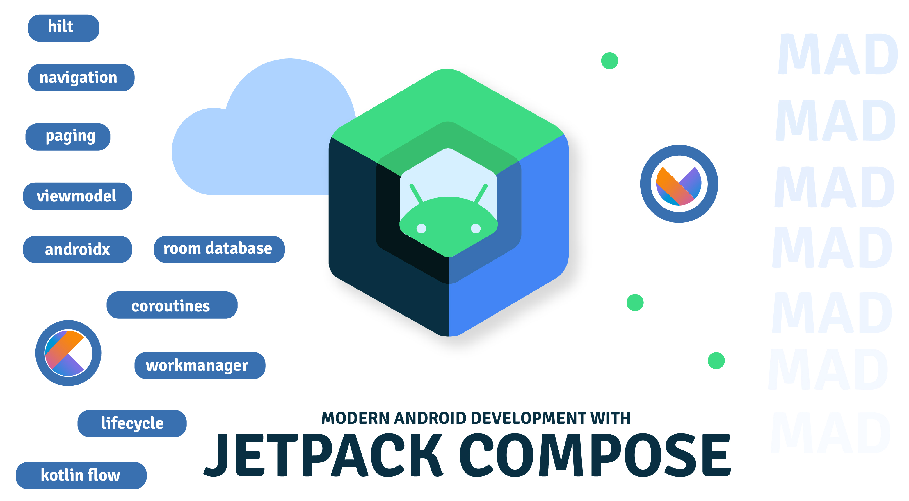

# MADJetpackApp

This App covers following MAD tools, API & Languages

- Fully written in Kotlin
- Jetpack Compose
- Navigation
- LifeCycle
- ViewModel
- Kotlin Flow
- Hilt (Dependency Injection)
- Paging
- Coroutines

  
